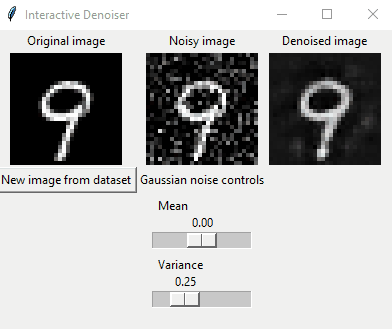

# Interactive autoencoder denoiser

I've trained a simple autoencoder (CNN based) on MNIST dataset. The task is to denoise Gaussian noise.

In my experiment, I evaluated the model on the noisy images (before training the model on the noisy images) to see how well it performs. The model wasn't able to denoise the images, which is expected since it never saw Gaussian noise during training.

During the second phase of training I added random Gaussian noise and evaluated the model again. It successfully denoised the images.



The training weights are saved in `autoencoder_after_noise_training.pth` file in this repository.

## How to use

View the notebook: `mnist_denoiser.ipynb` to see training and evaluation steps.

To run the interactive denoising program, run:

```
python interactive_denoising.py
```